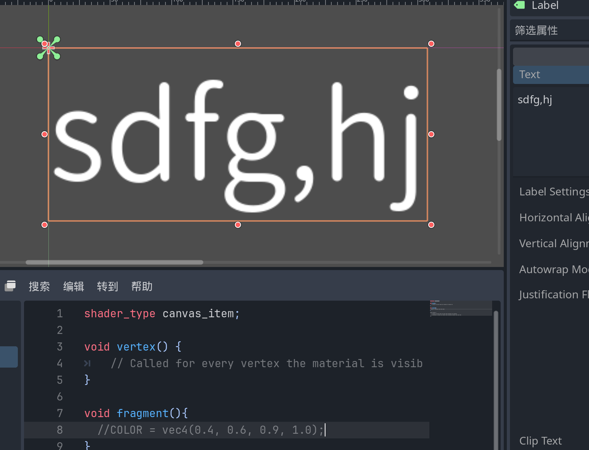
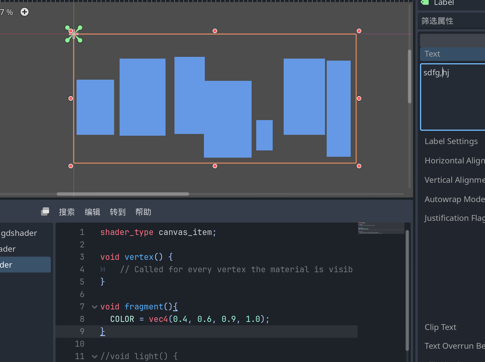

2D着色器：

```
shader_type canvas_item;
```

3D着色器：

```
shader_type spatial;
```


字体可被着色器修改的范围为该文字的大小决定：





注：对于文字使用顶点着色器时，顶点为方格的四个角


UV取值0~1，以左上点为原点

拿到像素颜色（只能在fragment中使用）

```
void fragment(){
  COLOR = texture(TEXTURE, UV); // Read from texture again.
  COLOR.b = 1.0; //set blue channel to 1.0
}
```


COLOR的RAGA值都是从0~1，（0，0，0，1）为黑色，（1，1，1，1）为白色，（1，1，1，0）为完全透明


着色器变量如何导出？（即在检查器面板显示）

```
uniform float size;
```

该变量可以同时被vertex和fragment使用

